# 我的世界（マインクラフト）中国版 プレイガイド
### ※完全自己責任です

## 紹介するプラットフォーム
- Windows
- Android,ios

## Windowsの場合

### 1. 我的世界クライアントのインストール
1. [公式サイト（mc.163.net）](https://mc.163.com/)からexeをダウンロード

2. インストーラー:
   - 左下のチェックボックスを選択
   - 「快速安装」をクリック

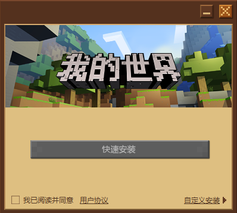

   - 次の画面で左下のチェックボックスを選択し、右側の緑のボタンをクリック

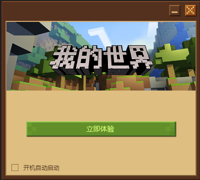

3. クリック後、右側の緑のボタンをクリック

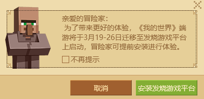

4. 別ウィンドウで中央の赤いボタンをクリック

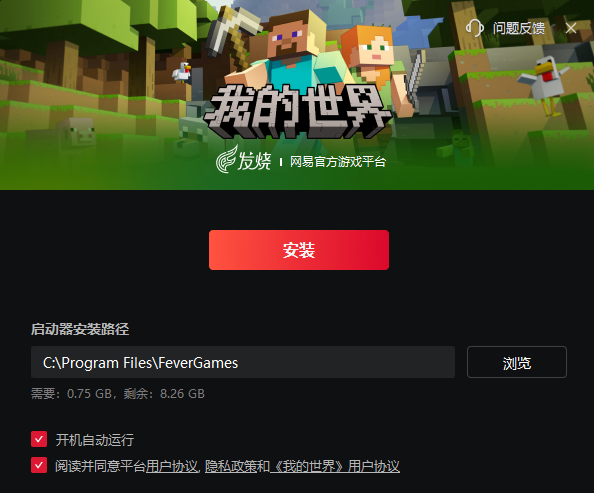

5. この画面になればインストール成功

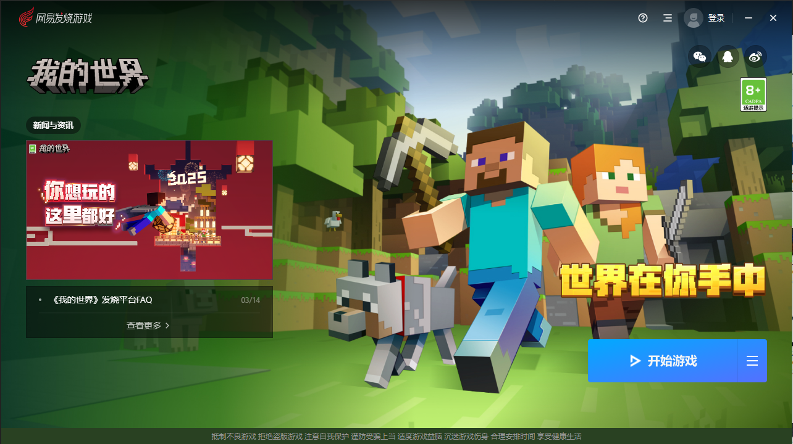

### 2. アカウント登録

1. 右上の「登録」ボタンをクリック

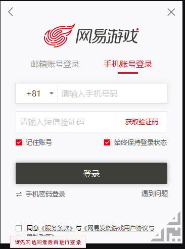

2. 電話番号を入力して登録（日本の電話番号使用可）
3. [NetEase ID管理ページ](https://id.163.com/ydaq/welcome?module=offline#/)でログイン

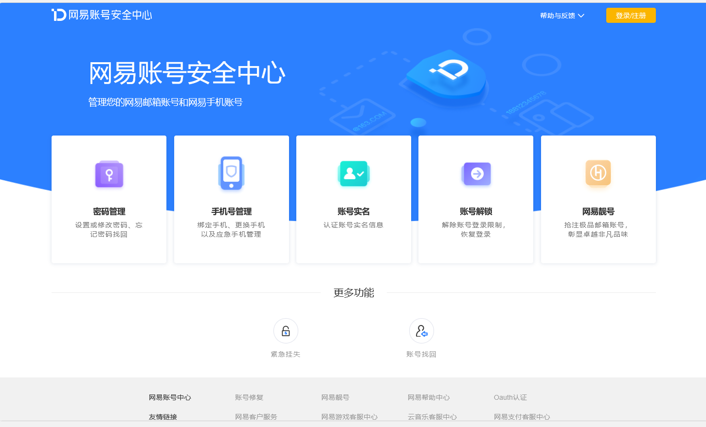

4. 実名認証
   ※日本の国籍では登録できないため、サイトで提供される情報を使用するのもいいでしょう
   [※自己責任](https://drive.google.com/file/d/1hx17p0O9VpEfXe8yjQKKcMRRtU0t-kwU/view)

### 3. VPN設定
1. [SoftEther VPN](https://www.softether-download.com/ja.aspx)から「VPN Gate Client」をダウンロード

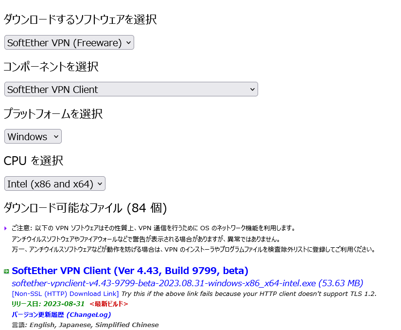

2. インストーラーを実行
3. VPN Gate接続:

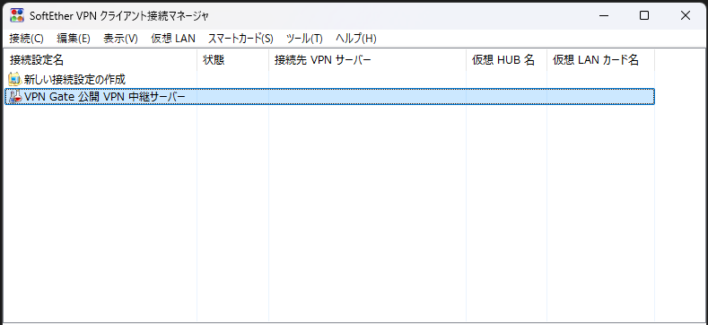
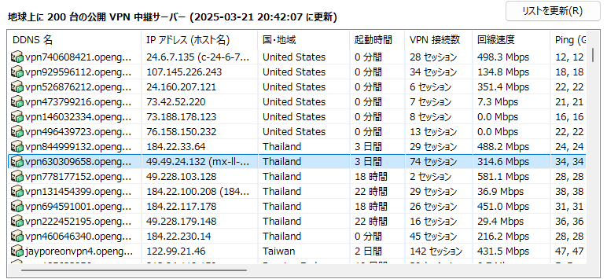

   - 「VPN Gate公開VPN中継サーバー」リストから接続先を選択
   - 推奨: Thailand
   - 代替: Hong Kong, China
   
   ※ランチャーを起動する際のみVPN必要

### 4. ゲーム起動
1. インストーラー画面に戻り、右下の青いボタンをクリック

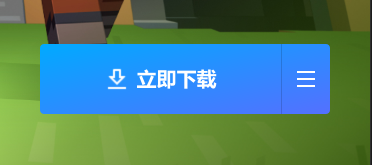

2. 表示されたボタンを再度クリック

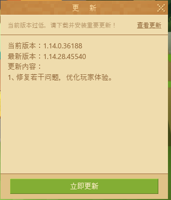

3. 更新をクリックして待機

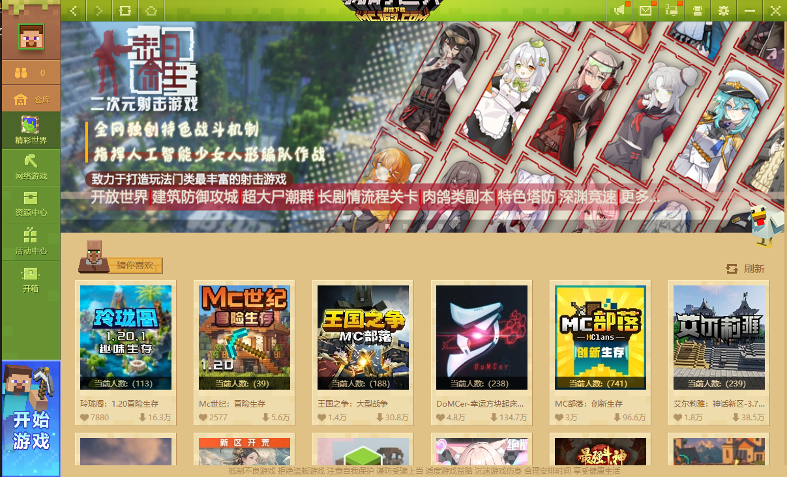

4. ランチャーが表示されたら成功です！自分で試行錯誤して楽しんでください！

## スマホの場合

### 1. アプリインストール

#### iOSの場合
1. [TestFlight](https://testflight.apple.com/join/mOxZm1dD)をApp Storeからインストール
2. リンクから我的世界（マインクラフト）中国版をダウンロード

#### Androidの場合
1. [TapTap](https://dispatch.taptap.cn/)をダウンロード・インストール
2. TapTap内で「我的世界」を検索
3. アプリをダウンロード・インストール

#### web clientからの場合(windowsでも可)
1. [cg.163](https://cg.163.com/#/mobile)にアクセスしサインイン
2. [cg.163/我的世界](https://cg.163.com/static/game/wdsjzxb?sourcepage=search&show=wdsjzxb&back=https%3A%2F%2Fcg.163.com%2F%23%2Fsearch%3Fkey%3D%25E6%2588%2591%25E7%259A%2584%25E4%25B8%2596%25E7%2595%258C)にアクセスし秒玩を押す
---
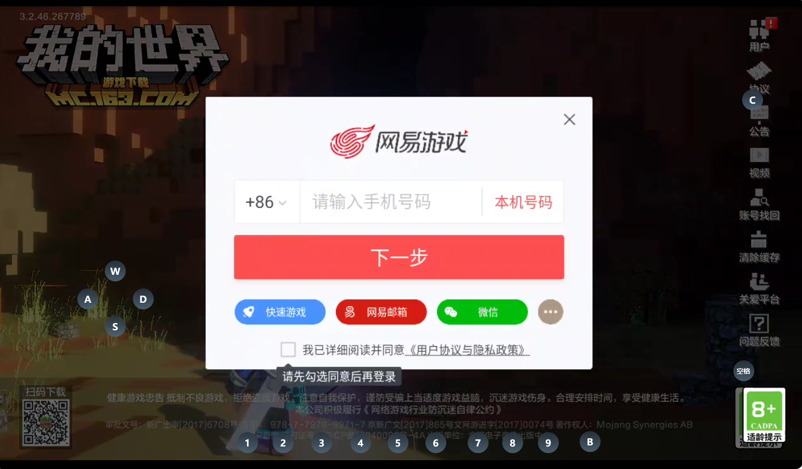

### 2. ログイン：
   - 青ボタン：ゲストプレイ
   - 赤ボタン：NetEaseアカウント
   - 緑ボタン：WeChat連携
   
※推奨：WeChat連携または電話番号認証

### 3. 実名登録
   ※日本の国籍では登録できないため、サイトで提供される情報を使用するのもいいでしょう
   [※自己責任](https://drive.google.com/file/d/1hx17p0O9VpEfXe8yjQKKcMRRtU0t-kwU/view)